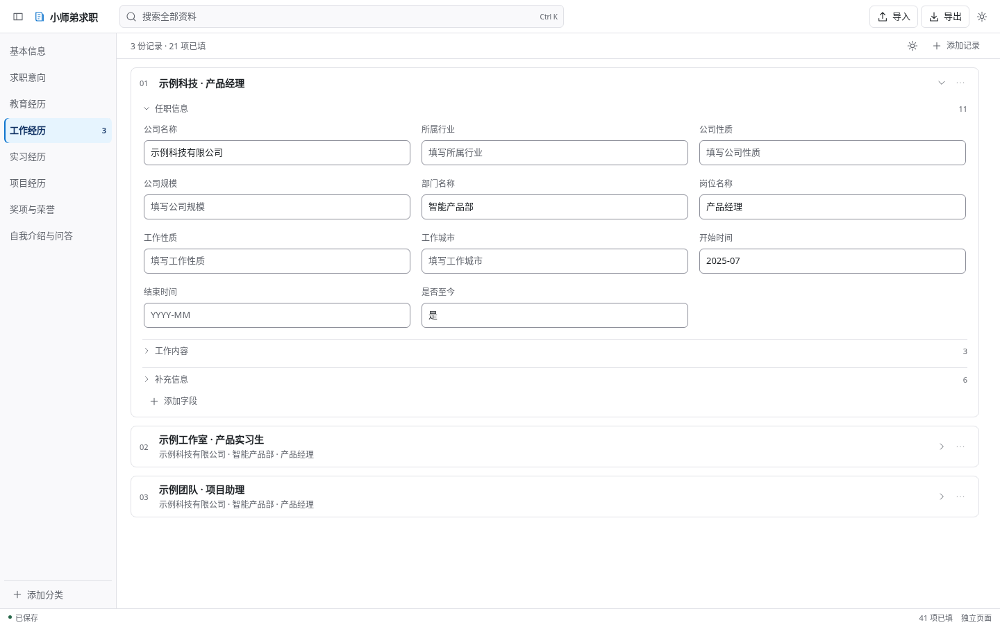

# 小师弟求职（JobFill）

[产品介绍](https://23aaaa.github.io/jobfill/) · [下载当前版本](https://github.com/23aaaa/jobfill/releases/tag/v1.1.0-rc.1) · [使用说明](docs/user-guide.md) · [常见问题](#常见问题) · [English](README.en.md)

> 整理一份资料，在招聘网页按项填写。

**本地求职资料管理与 Chrome 侧栏填写工具。** 在资料维护页中整理个人信息、教育和工作经历，打开招聘网页后，选中输入框，再点击侧栏中对应的内容即可填写。长段描述也可以直接复制。

除了插件内的资料页，还提供可独立打开的 **HTML 资料维护页** 和 **Excel 模板**。可以按自己的习惯整理资料，再通过导入导出交给插件使用。

当前版本：**1.1.0-rc.1**。安装包和资料文件已包含在仓库中，使用时无需安装 Node.js。

如果这个工具对你有帮助，欢迎 Star 收藏。使用中遇到问题，可以在 [Issues](https://github.com/23aaaa/jobfill/issues) 反馈。

## 为什么需要这个工具？

投递多家公司时，姓名、学校、实习经历和项目描述往往要反复填写。把这些内容集中整理后，可以在侧栏搜索、查看和填写，减少来回切换文件与复制粘贴。

- 个人信息和多段经历按分类管理，常用内容随时查找。
- 长段描述保留完整原文，填写前可以展开查看。
- 资料可导出备份，也可以在 HTML 页面或 Excel 中整理。

## 功能特性

| 功能 | 说明 |
|------|------|
| 资料维护页 | 通过界面编辑资料，支持自定义分类、记录、字段和分组 |
| Chrome 侧栏 | 默认展示已填写内容，选中网页输入框后按项填写，并显示目标网站 |
| 独立 HTML | 下载到本机后用浏览器打开，可编辑资料、搜索和导入导出 |
| Excel 导入导出 | 提供 20 个分类、230 个字段的模板；一类资料一张工作表，支持添加经历和字段 |
| 全局搜索 | 搜索分类、经历、字段名和非敏感内容，支持多个关键词 |
| 长文与敏感字段 | 长文可展开全文，敏感内容遮挡显示且不参与内容搜索 |
| 保存与备份 | 自动保存、最多三份本地历史，支持 JSON 和口令加密的 `.applyvault` 备份 |
| 复制与撤销 | 不能直接填写时可复制粘贴；支持撤销最近一次填写，避免覆盖后续手动修改 |
| 显示设置 | 分类与分组可折叠，提供六种高亮色和空项目显示设置 |

## 快速开始

### 方式一：安装插件

1. 在 [下载页](https://github.com/23aaaa/jobfill/releases/tag/v1.1.0-rc.1) 的 Assets 中下载 `xiaoshidi-extension-1.1.0-rc.1.zip`，解压到一个固定文件夹。
2. 使用 Chrome 116 或更新版本，打开 `chrome://extensions/`。
3. 开启右上角的「开发者模式」，点击「加载已解压的扩展程序」。
4. 选择解压后包含 `manifest.json` 的文件夹。
5. 打开招聘网页，点击浏览器工具栏中的「小师弟求职」，再点侧栏里的「编辑资料」。

也可以通过仓库的 **Code → Download ZIP** 下载全部文件。解压完整仓库后，应加载 **`dist/extension`** 文件夹。

### 方式二：用 HTML 或 Excel 整理资料

| 下载 | 使用方式 |
|------|----------|
| [独立 HTML 资料维护页](https://github.com/23aaaa/jobfill/releases/tag/v1.1.0-rc.1) | 在下载页选择 `xiaoshidi-profile-manager.html`，保存到本机后用浏览器打开即可编辑 |
| [Excel 资料模板](https://github.com/23aaaa/jobfill/releases/tag/v1.1.0-rc.1) | 在下载页选择 `xiaoshidi-profile-template.xlsx`，在「填写内容」列录入资料，保存后导入 |

独立 HTML 专门用于资料维护，网页填写由插件完成。HTML 页面与插件不自动同步，需要通过导出、导入交换资料。导入时先核对预览，确认替换前备份已有内容。

## 使用方法

### 整理资料

在资料维护页左侧选择分类，右侧填写内容。新增经历用「添加记录」，新增项目用「添加字段」，也可以添加自己的分类。记录的改名、复制、移动和删除位于对应的更多按钮中。

改动后约 550ms 自动保存，也可以按 `Ctrl/Cmd + S`。看到「已保存」后再关闭；若显示「未保存」，请先重试或导出草稿。

### 在招聘网页填写

1. 打开招聘网页，通过工具栏图标打开插件侧栏。
2. 点击网页上需要填写的输入框。
3. 核对侧栏显示的目标网站与字段，再点击对应资料。
4. 检查填写结果，继续处理下一项；遇到不支持的控件，可使用复制按钮后手动粘贴。
5. 由你自行保存或提交网站表单。

每次填写一个字段，不自动投递、提交表单或上传附件。

### 查找与显示

| 操作 | 说明 |
|------|------|
| 搜索资料 | `Ctrl/Cmd + K` 定位全局搜索，多个关键词用空格分开，`Esc` 退出搜索 |
| 查看长文 | 点击眼睛按钮展开完整内容；复制和填写使用完整原文 |
| 收起分类 | 使用左上角按钮收起或展开分类，记录和分组也可折叠 |
| 设置与帮助 | 切换主题、显示空项目、查看帮助和本地历史 |
| 打开侧栏 | 点击工具栏图标，也可使用 `Alt + Shift + Y` |

### Excel 怎么填写

一个分类一张工作表，主要使用「分组」「项目」「填写内容」三列。

- 新增经历时，复制整段行，包括标题栏，然后修改标题和内容。
- 新增字段时，在对应段落插入整行，填写项目名和内容。
- 复制整个工作表可以添加分类。隐藏列用于结构关联，无需自行编辑。
- 保存 `.xlsx` 后导入，先查看预览，再确认替换。删除行或工作表会影响对应资料，操作前请备份。

不要只对其中几列单独排序。模板按文本处理前导零和长号码；已经被表格软件舍入的号码需要重新输入。

更多操作见 [使用说明](docs/user-guide.md) 和 [Excel 格式说明](docs/excel-format.md)。

## 界面预览

资料维护页：



侧栏中的多段经历：


图中为虚构演示资料。

## 支持范围

插件采用通用表单填写机制，面向 Chrome 116+ 的普通网页。自动化测试覆盖文本输入框、文本区域、简单可编辑区域，以及目标变化、填写失败和撤销等行为。

复杂下拉框、日期选择器、文件上传等控件需要按网站实际情况操作。真实招聘网站、其他 Chromium 浏览器以及 Excel/WPS 桌面编辑仍需各自验收，不能保证所有网站都能直接填写。遇到问题欢迎提交 [Issue](https://github.com/23aaaa/jobfill/issues)。

## 隐私说明

- 资料保存在当前浏览器，产品代码不调用外部服务，也不向服务器上传资料。
- 浏览器本地资料库没有加密；敏感字段遮挡用于避免旁人直接看到内容。
- Excel 和 JSON 为明文文件，只有 `.applyvault` 备份使用口令加密。请保管好口令与备份。
- 招聘网页会收到你主动填入的内容，复制操作会写入系统剪贴板。
- 清除本机资料不会删除已导出的文件或已经填写到招聘网站的信息。

请勿把自己的资料文件、备份或含个人信息的截图提交到公开仓库。详细说明见 [安全与隐私文档](docs/security.md)。

## 常见问题

<details>
<summary><b>需要写代码或修改配置文件才能录入资料吗？</b></summary>

不需要。点击「编辑资料」即可在界面中填写，也可以使用独立 HTML 页面或 Excel 模板整理。

</details>

<details>
<summary><b>HTML 资料维护页和插件会自动同步吗？</b></summary>

不会。两者通过导入导出交换资料。日常直接在插件内的资料页编辑，步骤会更少；换电脑或浏览器前先导出备份。

</details>

<details>
<summary><b>填写后网页没有反应，或者保存后内容不见了？</b></summary>

先确认侧栏显示的是当前网站和目标输入框，重新点击输入框后再填写。部分网站的自定义控件需要手动操作，可以使用复制按钮粘贴。填写后请按网站流程保存，并核对保存结果。

</details>

<details>
<summary><b>可以同时填写全部字段或自动投递吗？</b></summary>

当前按字段逐项填写，不自动匹配整张表单，不自动提交或上传附件。完成后由你自行核对和提交。

</details>

<details>
<summary><b>支持哪些浏览器？</b></summary>

扩展清单要求 Chrome 116 或更新版本。其他浏览器的侧栏和权限行为需要单独确认，不能仅凭使用 Chromium 内核就保证兼容。

</details>

<details>
<summary><b>可以直接导入任意简历 PDF、Word 或 Excel 吗？</b></summary>

目前支持本产品格式的 Excel、JSON 与 `.applyvault` 备份，不提供任意简历文件的智能解析。请使用仓库中的 Excel 模板或产品导出的文件。

</details>

<details>
<summary><b>工具会收集我的个人信息吗？</b></summary>

产品不调用网络服务，资料在本机维护。点击填写后，目标网页会收到该项内容。你可以在 `extension/` 中查看实现，也可以通过加密备份导出资料。

</details>

<details>
<summary><b>为什么需要开发者模式安装？</b></summary>

仓库提供的是可加载的扩展文件夹和安装候选包，按上方步骤使用「加载已解压的扩展程序」安装。当前没有提供已通过 Chrome 商店审核的安装链接。

</details>

## 开发与测试

需要 Node.js 22+。产品没有 npm 运行依赖，构建不联网、不调用 AI 服务。

```bash
git clone https://github.com/23aaaa/jobfill.git
cd jobfill
npm run check
npm test
npm run build
```

构建生成 `dist/extension/`、独立 HTML、Excel 模板和插件 ZIP。浏览器测试另需 Python 与 Playwright：

```bash
python -m pip install -r requirements-dev.txt
python -m playwright install chromium
npm run test:browser
```

可以设置 `CHROMIUM_PATH` 指定 Chromium 可执行文件。自动化包含 127 项单元测试、58 项浏览器回归和 32 项界面回归；浏览器测试使用明确的存储、Chrome API、剪贴板等替身，不等同于真实招聘网站或商店验收。详见 [测试报告](docs/testing-report.md)。

`npm run verify:release` 用于检查正式发布所需的人工与运营证据。当前版本为安装验收候选包，缺少这些证据时返回 `HOLD` 是预期结果，不代表自动化测试失败。

## 项目结构

```text
jobfill/
├── extension/          # 扩展源码、资料界面、存储与填写逻辑
├── dist/extension/     # Chrome 可直接加载的扩展目录
├── release/            # 插件 ZIP、独立 HTML 和 Excel 模板
├── scripts/            # 构建、检查、测试与交付脚本
├── tests/              # 单元测试、浏览器测试及虚构示例
├── reports/            # 随交付提供的测试记录与界面截图
├── docs/               # 使用说明、架构、隐私与验收文档
└── package.json
```

技术实现为原生 JavaScript、HTML/CSS 和 Chrome Manifest V3，没有运行时框架依赖。

## 参与贡献

欢迎提交 Issue 和 Pull Request。反馈填写问题时，请提供浏览器版本、不带私人参数的网站地址、操作步骤和脱敏截图，不要上传真实简历资料。使用问题可在 [Discussions](https://github.com/23aaaa/jobfill/discussions) 提问，参与修改前请查看 [贡献说明](CONTRIBUTING.md)。

1. Fork 本仓库并创建工作分支。
2. 完成修改后运行相关检查与测试。
3. 提交 Pull Request，说明具体行为和验证结果。

## 赞赏支持

如果这个工具帮你节省了时间，欢迎请作者喝杯水：

<p align="center">
  
</p>

## 许可与第三方说明

项目许可范围见 [LICENSE](LICENSE)，第三方归属和许可见 [THIRD-PARTY-NOTICES.md](THIRD-PARTY-NOTICES.md)。
